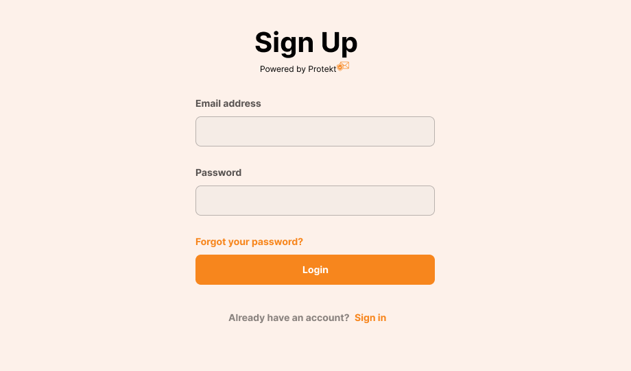

# Getting Started With Protekt Next.js SDK

The Protekt Next.js client library simplifies integrating Protekt in your Next.js app by wrapping Protekt's APIs into easy-to-use methods and functions. This guide will walk you through the steps to implement authentication in your Next.js application using Protekt. It's intended for developers who have a basic knowledge of [React](https://react.dev) and [Next.js App Router](https://nextjs.org).

## Prerequisites

Before you continue, ensure you complete the following requirements:

- [Node.js v21+](https://nodejs.org/) is installed on your system.
- You have signed up for a [Protekt account](https://app.prtekt.io).
- You have a Next.js v15+ project already set up.

## Install Protekt Next.js SDK

Navigate to your Next.js project root directory and run the following command to install Protekt's Next.js SDK:

```bash
npm install @hackmamba/protekt-js
```

## Step 1 - Create a new Protekt project

To create a new Protekt project, log in to your Protekt dashboard and navigate to **Projects** > **Create new Project** on the top menu bar to create a new project.

When prompted for the authentication method, select **Password-based** login. Once the project has been created, click on it and copy the **Protekt Login ID** string that appears in the **Configuration** tab.

Now go back to your Next.js project root and add the Protekt Login ID in `.env` as an environment variable:

```bash
PROTEKT_Login_ID = '<your_Protekt_Login_ID>'
```

## Step 2 - Configure Your Universal Login and Logout Components

In `src/app/auth/login.tsx`, import the prebuilt Login and Logout components from the SDK and provide them with your PROTEKT_LOGIN_ID.

```js
"use client";

import { Login } from "@hackmamba/protekt-js/universal";

const config = {
  protektID: process.env.NEXT_PUBLIC_PROTEKT_LOGIN_ID,
  redirectUri: "/dashboard",

};

export function Login() {
  return (
    <div>
      <Login
          config={config}
        />
    </div>
  );
}
```

This is what the login page looks like:



Notice that we’re using **NEXT_PUBLIC_PROTEKT_LOGIN_ID** since environment variables accessed in the client must be prefixed with _NEXT_PUBLIC_.

## Step 3 - Protect a Route in Next.js

The core idea behind authentication in a Next.js app is to restrict user access to sensitive data and information. You can protect pages or API routes by checking the user’s session from Protekt, using the `getSession()` helper method.

The following example adds authentication to protect a dashboard page named `src/app/dashboard/page.tsx`. If the user is not logged in, they are redirected to the login page we defined earlier:

```tsx
import { getSession } from "@hackmamba/protekt-js/server";
import { redirect } from "next/navigation";
import { Logout } from "@hackmamba/protekt-js/universal";

export default async function Dashboard() {
  const session = await getSession();

  if (!session) {
    redirect("/login");
  }

  return (
    <div>
      <h1>Welcome, {session.user.email}!</h1>
      <p>This is your secure dashboard.</p>
      <Logout
          config={{
            ProtektID: process.env.NEXT_PUBLIC_PROTEKT_LOGIN_ID,
            redirectUri: "/login"
          }}
          />
    </div>
  );
}
```

In the above code, the secure JWT token issued by Protekt is stored as a secure HTTP-only cookie in your browser and then used in subsequent requests. The `getSession()` method reads the cookie, validates the token, and returns a `sessions` object containing the user's data.

Basically, instead of handling raw cookies yourself in your code, `getSession()` abstracts all of this away, allowing you to focus on other important aspects of your application.


## Next Steps
Congratulations! You’ve just seen how quick and straightforward it is to implement authentication in Next.js with Protekt. From here, you can start exploring more advanced features and capabilities of Protekt to enhance your application’s security and user experience.

- [Protekt Dasboard](https://app.protekt.io): Learn how to customize and manage your Protekt projects
- [Protekt Next.js SDK API reference](/sdks/next-js): Explore the functions and methods in the Protekt Next.js SDK more fully.
- [Troubleshooting](/resources/troubleshooting): If you run into problems, see our troubleshooting guide for common errors and how to fix them.
